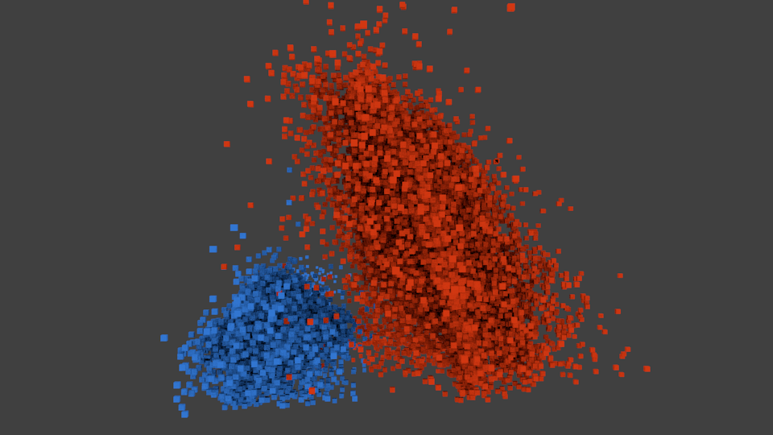
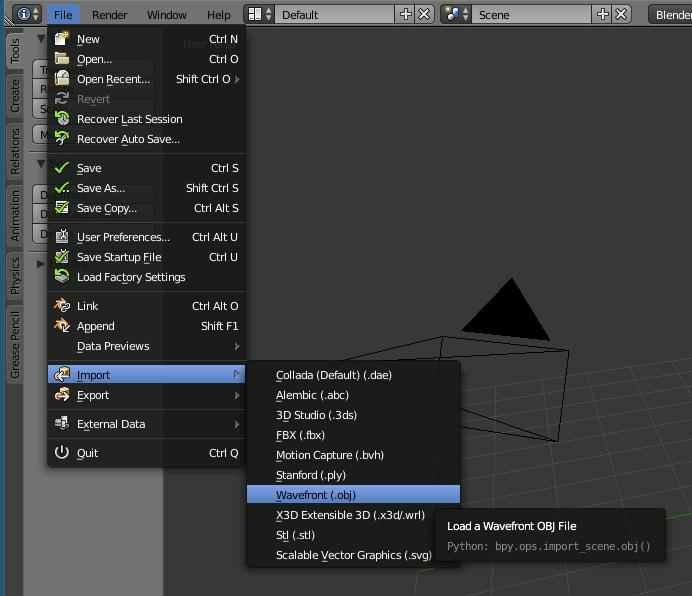

# Blendplot
Blendplot is a command line application for generating 3D data plots for use in Blender.

```
$ python3 blendplot abc.csv abc.obj period amplitude_Iband magnitude_Iband -c category 
Wrote plot file to abc.obj
Plotted 37099 points in 1.531214 seconds
```



## Usage
Blendplot allows you to generate a 3D data plot model by specifying dataset file, the output model file (`.obj`), and the names of the three (x,y,z) columns want to plot. Currently it only supports `.csv` input data files.

```
python3 blendplot INPUT_FILE OUTPUT_FILE X Y Z
```

For example, to create a model from a data file `data.csv` using the columns `height`, `weight`, and `cost` and output to a file `model.obj` you would run the following command.

```
python3 blendplot data.csv model.obj height weight cost
```

Once you have used the script to generate the model file, you can then import it into Blender by going to `File > Import > Wavefront (.obj)` and selecting the model file.



### Categories
To plot data that is grouped into categories, you can use the `-c` flag and specify the name of the column to group the data points by. Each different category will be its own object in the resulting model. This will allow you to easily style the groups with different materials.

```
python3 blendplot data.csv model.obj height weight cost -c category
```

## Licensing
The source code for Blendplot is available under the [MIT License](https://opensource.org/licenses/MIT), see `LICENSE` for more information.
